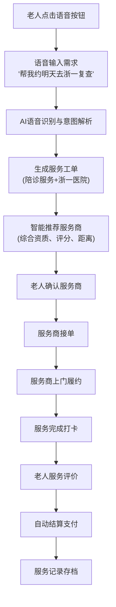
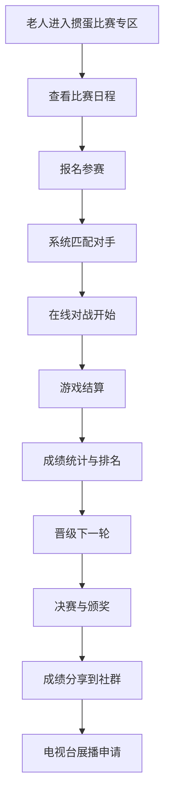
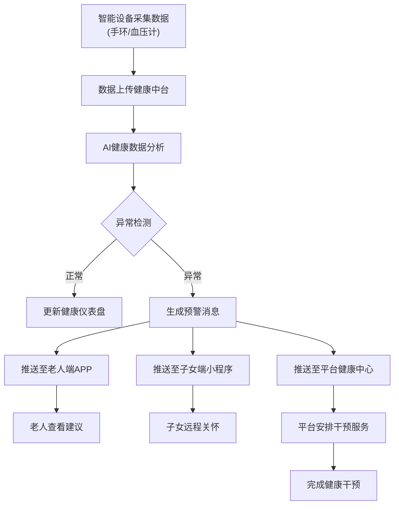

# 乐龄智家智慧养老服务平台 - 产品需求文档

## 1. 产品概述

乐龄智家是浙江首个AI+养老的数智服务平台，旨在通过整合顶尖产业资源、前沿数字科技与代际人才资本，系统性重构智慧养老服务体系。平台连接千万家庭，提供覆盖"衣食住行用饮游购娱"九大场景的一站式智慧养老服务，并创新性地引入掼蛋比赛等社交娱乐功能，激活老年人社交活力。

- **核心价值**：让AI成为老人的"生活管家"与"创意伙伴"，将"沉睡的养老金"转化为"流动的消费"，提升老年人生活质量
- **目标用户**：60岁以上老年人（核心）、子女家属（协同）、服务商（供给）、政府监管部门（监管）
- **战略定位**：浙江省养老服务平台级撮合与标准制定者，目标一年内实现11地市全覆盖

## 2. 核心功能

### 2.1 用户角色

| 角色 | 注册方法 | 核心权限 |
|------|----------|----------|
| 老年用户（C端） | 手机号注册，子女代注册，协会站点导入 | AI问诊、服务预约、AIGC创作、社区活动、掼蛋比赛、商城购物 |
| 子女家属（F端） | 微信小程序绑定父母账号 | 健康数据查看、服务代下单、远程关怀、账单管理 |
| 服务商（B端） | 企业资质审核注册 | 接单履约、服务记录、结算对账、培训认证 |
| 政府监管部门（G端） | 政务账号授权 | 数据驾驶舱、补贴核销、异常预警、服务质量监管 |

### 2.2 功能模块总览

#### 老人端APP（核心产品）
1. **首页**：语音助手入口、快捷服务、今日推荐、健康状态概览、活动预告
2. **AI生活管家**：语音服务下单、智能推荐、用药提醒、日程管理
3. **AIGC创作工坊**：AI绘画、AI音乐、AI视频、AI写作、作品展示
4. **乐享文娱**：活动报名、掼蛋比赛、节目展演、社群互动
5. **乐享健康**：健康仪表盘、AI问诊、用药管理、体检报告
6. **乐享生活**：九大场景服务、乐龄俱乐部、商城购物
7. **个人中心**：会员权益、服务记录、健康档案、家庭绑定

#### 子女端小程序
1. **首页**：父母健康概览、今日服务、紧急预警、待办事项
2. **健康监护**：实时数据、历史趋势、异常预警、健康建议
3. **服务管理**：代下单、服务进度、费用账单、评价反馈
4. **远程关怀**：视频通话、语音留言、活动提醒、礼物赠送
5. **家庭账户**：多老人管理、费用充值、会员管理

#### 服务商端工作台
1. **接单中心**：订单列表、智能派单、路线规划、服务类型筛选
2. **服务执行**：打卡签到、服务节点上报、照片上传、客户评价
3. **收益管理**：收入明细、提现申请、对账单、结算周期
4. **培训认证**：在线课程、技能考核、证书管理、晋升路径
5. **个人档案**：资质展示、评分体系、投诉处理、改进建议

#### 政府管理后台
1. **数据驾驶舱**：服务统计、补贴核销、区域分布、人群画像
2. **服务监管**：服务质量评估、投诉处理、服务商资质审核
3. **政策管理**：补贴标准、政策发布、资金分配、效果评估
4. **掼蛋比赛管理**：赛事创建、选手管理、赛程安排、成绩统计
5. **系统配置**：会员体系、服务定价、区域管理、数据导出

### 2.3 页面详情（老人端APP - 核心）

| 页面名称 | 模块名称 | 功能描述 |
|----------|----------|----------|
| 首页 | 语音助手入口 | 大字版语音按钮，支持方言识别，一键唤醒AI管家 |
| 首页 | 快捷服务栏 | 陪诊、送药、家政、维修、团餐等常用服务一键直达 |
| 首页 | 今日推荐 | AI智能推荐活动、课程、商品、健康提醒 |
| 馿页 | 健康状态概览 | 今日血压、心率、步数、睡眠质量卡片展示 |
| 馿页 | 活动预告 | 社区活动、掼蛋比赛、节目展演近期预告 |
| AI生活管家 | 语音服务下单 | 语音描述需求，AI自动识别意图并生成工单 |
| AI生活管家 | 智能推荐引擎 | 根据健康数据、活动记录、消费习惯个性化推荐 |
| AI生活管家 | 用药智能管家 | 拍照识别药盒、建立用药日历、定时语音提醒 |
| AI生活管家 | 家庭AI秘书 | 子女关怀消息、家庭日程、重要事项提醒 |
| AIGC创作工坊 | AI绘画工坊 | 语音描述画面，AI生成画作，支持多风格切换 |
| AIGC创作工坊 | AI音乐创作 | 哼唱旋律或输入歌词，AI自动谱曲编曲 |
| AIGC创作工坊 | AI短视频制作 | 上传照片+语音描述，AI生成配乐字幕视频 |
| AIGC创作工坊 | AI写作助手 | 口述故事，AI整理润色成回忆录、家书、诗歌 |
| AIGC创作工坊 | 作品展示墙 | 个人作品集、点赞评论、优秀作品展播申请 |
| 乐享文娱 | 活动报名中心 | 社区活动列表、在线报名、名额显示、取消报名 |
| 乐享文娱 | 掼蛋比赛专区 | 比赛报名、赛程查询、成绩排行、在线对战 |
| 乐享文娱 | 节目展演申请 | 节目类型选择、排练预约、演出报名、回放观看 |
| 乐享文娱 | 社群互动 | 兴趣圈子、话题讨论、点赞评论、私信聊天 |
| 乐享健康 | 健康仪表盘 | 血压、心率、血糖、血氧、睡眠、步数可视化 |
| 乐享健康 | AI智能问诊 | 7x24小时在线问诊、症状描述、用药建议 |
| 乐享健康 | 用药管理 | 药品清单、用药计划、复诊提醒、用药记录 |
| 乐享健康 | 体检报告解读 | AI解读体检报告、异常指标提醒、就医建议 |
| 乐享健康 | 设备数据同步 | 手环、血压计、血糖仪数据自动同步 |
| 乐享生活 | 九大场景入口 | 衣食住行用饮游购娱场景服务卡片 |
| 乐享生活 | 乐龄俱乐部 | 附近俱乐部查询、活动预约、商品自提、社交聚会 |
| 乐享生活 | 银发商城 | 适老商品分类、团购活动、直播带货、购物车 |
| 乐享生活 | 服务订单 | 服务列表、进度追踪、服务评价、售后处理 |
| 个人中心 | 会员权益中心 | 会员等级、权益详情、升级路径、续费管理 |
| 个人中心 | 服务记录档案 | 历史服务、费用明细、评价记录、投诉处理 |
| 个人中心 | 健康档案管理 | 个人健康数据、体检报告、用药历史、医生建议 |
| 个人中心 | 家庭绑定设置 | 子女账号绑定、权限管理、数据共享设置 |

## 3. 核心流程

### 3.1 AI语音服务下单流程

用户通过语音助手发起服务请求，AI自动识别意图、匹配服务、生成工单、推荐服务商、完成履约、评价反馈。

### 3.2 掼蛋比赛流程

老人报名参赛、在线对战、成绩统计、晋级奖励、社交分享。

### 3.3 健康监测与预警流程

智能设备数据采集、AI分析、异常预警、多端联动、及时干预。

## 4. 用户界面设计

### 4.1 设计风格

**老人端APP（核心产品）**
- **主色调**：温暖橙色系（#FF9F43）代表活力与温暖，辅以深蓝色（#2C3E50）代表稳重
- **配色方案**：
  - 主色：#FF9F43（温暖橙）- 用于重要按钮、导航高亮
  - 辅色：#2C3E50（深蓝）- 用于标题、重要文字
  - 背景：#FFFFFF（纯白）- 保持清晰易读
  - 卡片背景：#F8F9FA（浅灰）- 层次分明
  - 成功色：#27AE60（绿色）- 用于健康数据、完成状态
  - 警告色：#E74C3C（红色）- 用于异常预警、紧急状态
- **按钮样式**：大圆角矩形（24px），高对比度配色，最小高度48px，最小宽度120px
- **字体方案**：
  - 标题：思源黑体 CN Bold，36-48px
  - 正文：思源黑体 CN Regular，24-28px（比常规APP大50%）
  - 辅助文字：思源黑体 CN Light，20-24px
- **布局风格**：卡片式布局，大间距（32px），大图标（64px以上），左侧导航栏
- **图标风格**：圆润图标，配合文字标签，颜色鲜明

**子女端小程序**
- **主色调**：现代蓝绿色系（#1ABC9C）代表科技与关怀
- **配色方案**：
  - 主色：#1ABC9C（蓝绿）- 科技感与温情结合
  - 辅色：#34495E（深灰）- 稳重专业
  - 背景：#F7F9FC（浅蓝灰）- 清爽舒适
  - 卡片：#FFFFFF（纯白）
  - 成功：#2ECC71（绿色）
  - 预警：#E67E22（橙色）- 区分老人端红色预警
- **字体方案**：苹方字体，常规尺寸（16-18px正文）
- **布局风格**：卡片式、紧凑型、顶部导航、底部操作栏
- **图标风格**：线性图标，简洁现代

**服务商端工作台**
- **主色调**：专业蓝色系（#3498DB）代表效率与专业
- **配色方案**：蓝白为主，清晰分区，高效视觉
- **布局风格**：仪表板式、数据密集、侧边导航、快捷操作
- **字体方案**：黑体，常规尺寸，强调数据展示

**政府管理后台**
- **主色调**：政务蓝（#0066CC）代表权威与规范
- **配色方案**：蓝白配色，数据图表彩色区分
- **布局风格**：数据驾驶舱、图表密集、顶部导航、左侧菜单
- **字体方案**：宋体/黑体，表格友好

### 4.2 页面设计概览（老人端APP）

| 页面名称 | 模块名称 | UI元素 |
|----------|----------|--------|
| 首页 | 语音助手入口 | 圆形大按钮（120px直径），橙色渐变，带麦克风图标，点击动效 |
| 馿页 | 快捷服务栏 | 横向滚动卡片，每个卡片64x64px图标+28px文字，卡片间距32px |
| 馿页 | 健康状态概览 | 4个数据卡片（血压、心率、步数、睡眠），每个卡片高度120px，带趋势小图标 |
| 馿页 | 活动预告 | 纵向卡片列表，活动图片+标题+时间+报名按钮，卡片高度180px |
| AI生活管家 | 语音服务下单 | 全屏语音界面，大字提示"请说出您的需求"，语音波形动画 |
| AI生活管家 | 用药提醒卡片 | 时间轴式用药列表，药品图标+名称+时间+状态标记 |
| AIGC创作工坊 | AI绘画工坊 | 大画布展示区，风格选择按钮（水墨/油画/水彩），保存打印按钮 |
| AIGC创作工坊 | 作品展示墙 | 网格式作品卡片（3x3布局），每个卡片带点赞评论数，点击放大查看 |
| 乐享文娱 | 掼蛋比赛专区 | 比赛日历卡片、报名按钮、排行榜列表、在线对战入口 |
| 乐享健康 | 健康仪表盘 | 6个数据仪表盘卡片，圆形进度条显示，颜色区分正常/异常 |
| 乐享健康 | AI问诊界面 | 聊天界面样式，医生头像+建议文字，一键下单陪诊按钮 |
| 乐享生活 | 九大场景卡片 | 9个场景图标卡片（3x3网格），每个卡片带快速下单入口 |
| 乐享生活 | 银发商城 | 商品网格布局（2列），商品图片+价格+购买按钮 |
| 个人中心 | 会员权益展示 | 等级徽章+权益列表+续费按钮，渐变背景卡片 |

### 4.3 响应式适配

**老人端APP**：以平板尺寸优先（10英寸以上），适配手机大屏（6.7英寸以上）
- 平板模式：左侧导航栏+右侧内容区
- 手机模式：底部导航栏+顶部内容区，横向滚动卡片

**子女端小程序**：手机优先（微信小程序标准尺寸）
- 紧凑布局，快速信息浏览
- 支持横屏查看健康数据图表

**服务商端**：移动端优先，支持桌面端操作
- 手机：接单打卡核心功能
- 桌面：收益管理、培训认证详细功能

**政府端**：桌面端优先（数据驾驶舱）
- 大屏展示：数据可视化图表
- 响应式支持移动查看关键数据

### 4.4 交互优化

**老人端特殊优化**：
- 所有可点击区域最小48x48px
- 重要操作确认弹窗，防止误操作
- 长按操作替代部分复杂手势
- 语音导航辅助（"您可以点击这里..."）
- 高对比度模式（针对视力障碍）
- 字体可调节（24px/28px/32px三档）
- 操作反馈强化（震动+声音+视觉）
- 紧急SOS按钮（红色，固定顶部，一键呼救）

**子女端优化**：
- 异常信息醒目提示（颜色+图标+动画）
- 一键代下单操作流畅
- 数据图表可交互缩放
- 定时提醒设置便捷

## 5. 特色功能详解

### 5.1 掼蛋比赛系统

**功能定位**：激活老年人社交活力，构建银发竞技娱乐生态

**核心功能**：
1. **比赛报名**：在线报名、名额管理、资格审核
2. **在线对战**：实时对局、AI裁判、公平配对
3. **赛程管理**：淘汰赛制、晋级规则、时间安排
4. **成绩统计**：积分排名、历史战绩、成就徽章
5. **社交互动**：战队组建、好友对战、分享炫耀
6. **电视台联动**：优秀选手推荐至电视台节目展播

**商业模式**：
- 免费参赛（会员权益）
- 高级赛事报名费（9.9-99元）
- 战队冠名赞助
- 电视台展播申请（199元）
- 线下决赛门票销售

### 5.2 AI创作工坊特色

**创作类型**：
- AI绘画：老人语音描述画面意境，AI生成艺术作品
- AI音乐：哼唱旋律或口述歌词，AI谱曲编曲
- AI视频：上传老照片+语音讲述，AI制作回忆视频
- AI写作：口述人生故事，AI整理成回忆录

**社交价值**：
- 作品分享到社群、家族群、朋友圈
- 优秀作品电视台展播
- 作品打印实物（帆布画、抱枕、纪念册）
- 代际共创（老人+学生联合创作）

### 5.3 健康监测闭环

**数据来源**：
- 智能穿戴设备：手环（心率、步数、睡眠）
- 医疗设备：血压计、血糖仪、心电贴
- 主动上报：症状描述、用药记录

**AI分析**：
- 趋势分析：连续数据变化趋势
- 异常预警：超出正常范围即时预警
- 智能建议：基于数据的健康建议

**联动干预**：
- 老人端：建议提醒+一键预约就医
- 子女端：预警推送+远程关怀+代下单
- 平台端：安排陪诊、送药、上门护理

## 6. 商业模式支撑

### 6.1 会员体系设计

| 会员等级 | 年费 | 核心权益 | 掼蛋权益 |
|----------|------|----------|----------|
| 基础会员 | 188元 | APP全功能、2次AI问诊/月、商城9.8折 | 免费参赛基础赛事 |
| 银卡会员 | 968元 | 基础权益+旅居9折+电视台节目优先报名 | 免费参赛所有赛事+电视台展播优先权 |
| 金卡会员 | 2888元 | 银卡权益+居家照料8.5折+健康管理师一对一 | 专属高级赛事+战队组建特权 |
| 钻石会员 | 6688元 | 金卡权益+长护险配套+智能设备全套免费租赁 | VIP赛事通道+线下决赛VIP座位 |

### 6.2 服务佣金模式

- 陪诊服务：15-25%佣金
- 家政服务：15-25%佣金
- 商城销售：12-18%佣金
- 掼蛋赛事：报名费分成+赞助分成

### 6.3 IP变现模式

- 掼蛋比赛电视节目：赛事冠名、广告植入
- AIGC作品展播：作品版权授权
- 培训认证：掼蛋技巧课程、AI创作课程

## 7. 数据安全与隐私

- 所有健康数据加密存储
- 用户自主控制数据共享范围
- 子女端查看需老人授权
- 符合国家医疗数据安全规范
- 定期安全审计与渗透测试