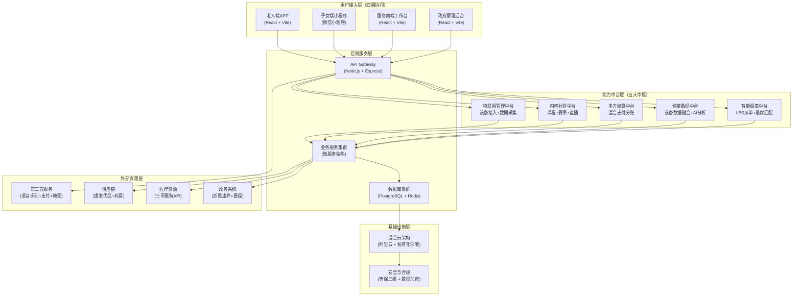
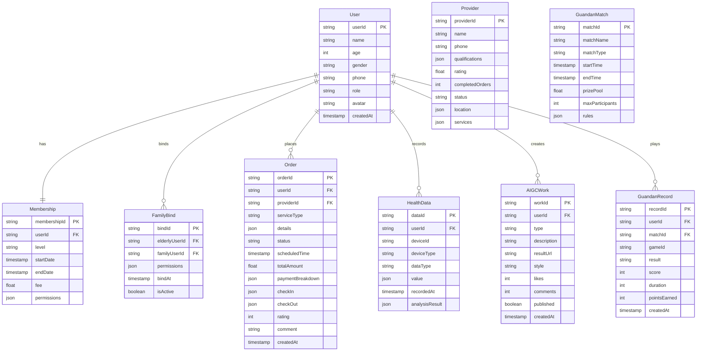
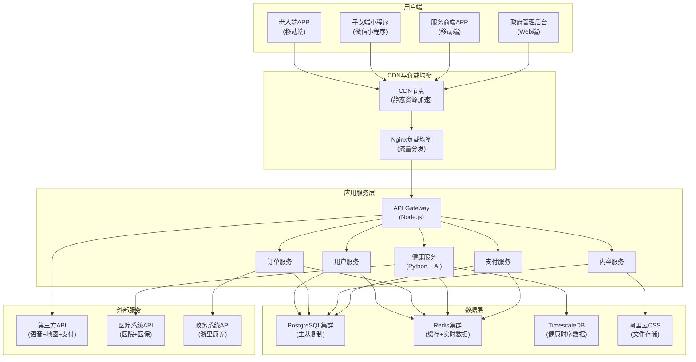

# 乐龄智家智慧养老服务平台 - 技术架构文档

## 1. 系统架构设计

乐龄智家采用"五层一体、云端协同、虚实融合"的智慧养老技术中台架构，支撑四端产品（老人端APP、子女端小程序、服务商端工作台、政府管理后台）的统一服务。



## 2. 技术栈描述

### 2.1 前端技术栈

#### 老人端APP（核心产品）
- **框架**：React 18 + TypeScript
- **构建工具**：Vite 5
- **UI组件库**：自定义适老化组件库（基于Tailwind CSS）
- **状态管理**：React Query（数据请求）+ Zustand（全局状态）
- **语音交互**：
  - 科大讯飞语音SDK（方言识别）
  - Web Speech API（浏览器原生语音）
- **健康数据可视化**：Chart.js + React-chartjs-2
- **地图服务**：高德地图SDK
- **支付集成**：微信支付 + 支付宝支付SDK

#### 子女端小程序
- **框架**：微信小程序原生框架
- **语言**：JavaScript + WXML + WXSS
- **组件库**：自定义组件库（适老化风格）
- **状态管理**：小程序全局数据
- **健康图表**：ECharts小程序版
- **实时通信**：WebSocket（健康数据实时推送）

#### 服务商端工作台
- **框架**：React 18 + TypeScript
- **构建工具**：Vite 5
- **UI组件库**：Ant Design Mobile（定制）
- **地图导航**：高德地图SDK + 路径规划
- **数据可视化**：ECharts
- **实时通知**：WebSocket + Service Worker

#### 政府管理后台
- **框架**：React 18 + TypeScript
- **构建工具**：Vite 5
- **UI组件库**：Ant Design 5（企业版）
- **数据可视化**：ECharts 5（驾驶舱图表）
- **表格组件**：AG Grid Enterprise（大数据表格）
- **报表导出**：ExcelJS + PDFKit

### 2.2 后端技术栈

- **API Gateway**：Node.js + Express 4
- **微服务架构**：
  - 用户服务：Node.js + Express
  - 订单服务：Node.js + Express
  - 健康服务：Python + FastAPI（AI分析）
  - 内容服务：Node.js + Express
  - 支付服务：Node.js + Express
- **数据库**：
  - 主数据库：PostgreSQL 15（业务数据）
  - 缓存数据库：Redis 7（会话、实时数据）
  - 时序数据库：TimescaleDB（健康数据）
- **消息队列**：RabbitMQ（异步任务）
- **搜索引擎**：Elasticsearch 8（商品搜索、内容搜索）
- **文件存储**：阿里云OSS（图片、视频）

### 2.3 第三方服务集成

| 服务类型 | 服务提供商 | 具体功能 |
|----------|-----------|----------|
| 语音识别 | 科大讯飞 | 方言识别、语音合成 |
| 地图服务 | 高德地图 | LBS定位、路径规划、POI搜索 |
| 支付服务 | 微信支付、支付宝 | 支付、退款、分账 |
| AI问诊 | 阿里健康、蚂蚁阿福 | 在线问诊、用药建议 |
| 医疗数据 | 合作三甲医院API | 体检报告、就诊记录 |
| 政务数据 | 浙里康养API | 补贴核销、长护险数据 |
| 视频直播 | 腾讯云直播 | 掼蛋比赛直播、商城直播 |
| 推送服务 | 极光推送 | 多端消息推送 |
| IoT设备 | 各品牌设备SDK | 健康设备数据接入 |

### 2.4 开发与部署工具

- **代码管理**：Git + GitLab
- **CI/CD**：Jenkins + Docker + Kubernetes
- **监控告警**：Prometheus + Grafana
- **日志管理**：ELK Stack（Elasticsearch + Logstash + Kibana）
- **API测试**：Postman + Newman
- **性能测试**：JMeter

## 3. 路由定义

### 3.1 老人端APP路由

| 路由路径 | 页面名称 | 功能描述 |
|----------|----------|----------|
| `/` | 首页 | 语音助手入口、快捷服务、健康概览、活动预告 |
| `/ai-assistant` | AI生活管家 | 语音服务下单、智能推荐、用药提醒 |
| `/ai-assistant/voice-order` | 语音下单界面 | 全屏语音交互界面 |
| `/ai-assistant/medicine` | 用药管家 | 用药日历、药品识别、提醒设置 |
| `/aigc-studio` | AIGC创作工坊 | AI创作入口 |
| `/aigc-studio/painting` | AI绘画工坊 | 语音描述生成画作 |
| `/aigc-studio/music` | AI音乐创作 | 哼唱谱曲、歌词创作 |
| `/aigc-studio/video` | AI视频制作 | 照片视频生成 |
| `/aigc-studio/writing` | AI写作助手 | 回忆录、家书创作 |
| `/aigc-studio/gallery` | 作品展示墙 | 个人作品集、社群展示 |
| `/entertainment` | 乐享文娱 | 活动报名、掼蛋比赛、节目展演 |
| `/entertainment/guandan` | 掼蛋比赛专区 | 比赛报名、在线对战、成绩排行 |
| `/entertainment/guandan/match/:matchId` | 掼蛋对战界面 | 实时对局、游戏结算 |
| `/entertainment/guandan/ranking` | 掼蛋排行榜 | 积分排名、历史战绩 |
| `/entertainment/activities` | 活动报名中心 | 社区活动列表、报名管理 |
| `/entertainment/shows` | 节目展演申请 | 节目报名、排练预约 |
| `/entertainment/community` | 社群互动 | 兴趣圈子、话题讨论 |
| `/health` | 乐享健康 | 健康仪表盘、AI问诊、用药管理 |
| `/health/dashboard` | 健康仪表盘 | 健康数据可视化 |
| `/health/ai-doctor` | AI智能问诊 | 在线问诊界面 |
| `/health/medicine` | 用药管理 | 药品清单、用药计划 |
| `/health/devices` | 设备数据同步 | 设备绑定、数据查看 |
| `/health/report/:reportId` | 体检报告解读 | 报告详情、AI解读 |
| `/life` | 乐享生活 | 九大场景、乐龄俱乐部、商城 |
| `/life/services` | 九大场景服务 | 服务分类、下单入口 |
| `/life/club` | 乐龄俱乐部 | 附近俱乐部、活动预约 |
| `/life/shop` | 银发商城 | 商品分类、购物车 |
| `/life/orders` | 服务订单 | 订单列表、进度追踪 |
| `/profile` | 个人中心 | 会员权益、服务记录、健康档案 |
| `/profile/membership` | 会员权益中心 | 等级展示、权益详情 |
| `/profile/services` | 服务记录档案 | 历史服务、费用明细 |
| `/profile/health-archive` | 健康档案管理 | 健康数据、体检报告 |
| `/profile/family` | 家庭绑定设置 | 子女绑定、权限管理 |
| `/sos` | 紧急求助 | SOS一键呼救界面 |
| `/settings` | 设置 | 字体调节、高对比度、语音设置 |

### 3.2 子女端小程序路由

| 路由路径 | 页面名称 | 功能描述 |
|----------|----------|----------|
| `pages/index/index` | 首页 | 父母健康概览、今日服务、紧急预警 |
| `pages/health/dashboard` | 健康监护 | 实时数据、历史趋势、异常预警 |
| `pages/health/detail` | 健康详情 | 单项健康数据详情、趋势图表 |
| `pages/service/orders` | 服务管理 | 代下单、服务进度、费用账单 |
| `pages/service/create` | 创建服务订单 | 选择服务类型、填写需求 |
| `pages/care/video-call` | 远程关怀 | 视频通话、语音留言 |
| `pages/care/reminders` | 活动提醒 | 设置提醒、查看提醒记录 |
| `pages/family/account` | 家庭账户 | 多老人管理、费用充值 |
| `pages/family/bind` | 绑定老人 | 添加老人账号、权限设置 |
| `pages/alert/emergency` | 紧急预警 | 异常预警详情、一键处理 |

### 3.3 服务商端工作台路由

| 路由路径 | 页面名称 | 功能描述 |
|----------|----------|----------|
| `/` | 接单中心 | 订单列表、智能派单、状态筛选 |
| `/orders/:orderId` | 订单详情 | 订单信息、客户信息、路线规划 |
| `/orders/:orderId/execute` | 服务执行 | 打卡签到、节点上报、照片上传 |
| `/earnings` | 收益管理 | 收入明细、提现申请、对账单 |
| `/training` | 培训认证 | 在线课程、技能考核、证书管理 |
| `/profile` | 个人档案 | 资质展示、评分体系、投诉处理 |
| `/schedule` | 日程管理 | 工作日程、休息设置、请假申请 |

### 3.4 政府管理后台路由

| 路由路径 | 页面名称 | 功能描述 |
|----------|----------|----------|
| `/` | 数据驾驶舱 | 服务统计、补贴核销、区域分布 |
| `/monitor/services` | 服务监管 | 服务质量评估、投诉处理、资质审核 |
| `/monitor/complaints` | 投诉管理 | 投诉列表、处理流程、统计分析 |
| `/policy/subsidies` | 补贴管理 | 补贴标准、资金分配、核销记录 |
| `/policy/standards` | 政策标准 | 政策发布、效果评估、标准制定 |
| `/guandan/matches` | 掼蛋比赛管理 | 赛事创建、选手管理、赛程安排 |
| `/guandan/results` | 掼蛋成绩统计 | 成绩排行、数据分析、报表导出 |
| `/system/members` | 会员体系配置 | 等级设置、权益配置、价格管理 |
| `/system/pricing` | 服务定价配置 | 服务类型、价格标准、区域定价 |
| `/system/users` | 用户管理 | 用户列表、权限管理、数据导出 |
| `/system/providers` | 服务商管理 | 商家列表、资质审核、评级管理 |

## 4. API定义

### 4.1 核心API接口

#### 用户服务API

```typescript
// 用户注册与登录
interface UserRegisterRequest {
  phone: string;
  password?: string;
  verificationCode: string;
  role: 'elderly' | 'family' | 'provider' | 'government';
  profile?: {
    name: string;
    age: number;
    gender: 'male' | 'female';
    address?: string;
    emergencyContact?: string;
  };
}

interface UserRegisterResponse {
  userId: string;
  token: string;
  refreshToken: string;
  profile: UserProfile;
}

interface UserProfile {
  userId: string;
  name: string;
  age: number;
  gender: string;
  phone: string;
  avatar?: string;
  membershipLevel: 'basic' | 'silver' | 'gold' | 'diamond';
  familyMembers?: FamilyMember[];
  createdAt: string;
}

// 老人绑定子女
interface BindFamilyMemberRequest {
  elderlyUserId: string;
  familyUserId: string;
  permissions: {
    viewHealth: boolean;
    placeOrder: boolean;
    viewFinance: boolean;
    receiveAlerts: boolean;
  };
}

interface BindFamilyMemberResponse {
  bindId: string;
  elderlyUserId: string;
  familyUserId: string;
  permissions: PermissionSet;
  bindAt: string;
}
```

#### 订单服务API

```typescript
// AI语音下单
interface VoiceOrderRequest {
  userId: string;
  voiceText: string;
  audioFile?: string; // Base64编码的音频文件
  location: {
    latitude: number;
    longitude: number;
    address: string;
  };
}

interface VoiceOrderResponse {
  orderId: string;
  parsedIntent: {
    serviceType: 'accompaniment' | 'medicine_delivery' | 'housekeeping' | 'maintenance' | 'meal';
    details: {
      hospitalName?: string;
      department?: string;
      preferredTime?: string;
      description?: string;
    };
  };
  recommendedProviders: Provider[];
  estimatedPrice: number;
}

// 服务订单创建
interface CreateOrderRequest {
  userId: string;
  serviceType: string;
  providerId?: string; // AI推荐或用户选择
  scheduledTime: string;
  location: Location;
  details: OrderDetails;
  paymentMethod: 'personal' | 'insurance' | 'subsidy' | 'mixed';
}

interface CreateOrderResponse {
  orderId: string;
  status: 'pending' | 'assigned' | 'confirmed';
  provider?: Provider;
  estimatedPrice: number;
  paymentBreakdown: PaymentBreakdown;
}

interface OrderDetails {
  description?: string;
  hospitalName?: string;
  department?: string;
  medicineList?: string[];
  items?: string[];
}

interface PaymentBreakdown {
  personalAmount: number;
  insuranceAmount: number;
  subsidyAmount: number;
  totalAmount: number;
}

// 订单状态更新
interface UpdateOrderStatusRequest {
  orderId: string;
  status: 'assigned' | 'in_progress' | 'completed' | 'cancelled';
  providerId?: string;
  checkIn?: {
    time: string;
    location: Location;
    photo?: string;
  };
  checkOut?: {
    time: string;
    location: Location;
    photo?: string;
    notes?: string;
  };
}

interface UpdateOrderStatusResponse {
  orderId: string;
  status: string;
  updatedAt: string;
  familyNotification: boolean; // 是否通知子女端
}
```

#### 健康服务API

```typescript
// 健康数据上传
interface HealthDataUploadRequest {
  userId: string;
  deviceId: string;
  deviceType: 'band' | 'blood_pressure' | 'glucose' | 'ecg';
  data: HealthDataPoint[];
  timestamp: string;
}

interface HealthDataPoint {
  type: 'heart_rate' | 'blood_pressure' | 'glucose' | 'oxygen' | 'step' | 'sleep';
  value: number | object;
  unit: string;
}

interface HealthDataUploadResponse {
  dataId: string;
  userId: string;
  analysisResult?: HealthAnalysisResult;
  alerts?: HealthAlert[];
}

interface HealthAnalysisResult {
  overallScore: number; // 0-100
  insights: string[];
  recommendations: string[];
  abnormalIndicators: string[];
}

interface HealthAlert {
  alertId: string;
  type: 'high_blood_pressure' | 'low_heart_rate' | 'high_glucose' | 'abnormal_sleep' | 'emergency';
  severity: 'low' | 'medium' | 'high' | 'critical';
  message: string;
  timestamp: string;
  recommendedActions: string[];
}

// AI问诊
interface AIConsultationRequest {
  userId: string;
  symptoms: string;
  voiceText?: string;
  history?: HealthHistory;
}

interface AIConsultationResponse {
  consultationId: string;
  diagnosis: {
    possibleConditions: Condition[];
    confidence: number;
    urgency: 'low' | 'medium' | 'high' | 'emergency';
  };
  recommendations: {
    medications?: MedicationRecommendation[];
    lifestyle?: string[];
    followUp?: string;
  };
  shouldConsultDoctor: boolean;
  hospitalRecommendation?: HospitalRecommendation;
}

interface MedicationRecommendation {
  name: string;
  dosage: string;
  frequency: string;
  precautions: string[];
}

interface HospitalRecommendation {
  hospitalName: string;
  department: string;
  address: string;
  distance: number;
  availableSlots: string[];
}

// 健康仪表盘数据
interface HealthDashboardRequest {
  userId: string;
  dateRange: {
    start: string;
    end: string;
  };
  indicators: string[]; // ['heart_rate', 'blood_pressure', 'step', 'sleep']
}

interface HealthDashboardResponse {
  userId: string;
  overallScore: number;
  indicators: IndicatorSummary[];
  trends: TrendData[];
  alerts: HealthAlert[];
  recommendations: string[];
}

interface IndicatorSummary {
  type: string;
  currentValue: number;
  normalRange: { min: number; max: number };
  status: 'normal' | 'abnormal' | 'critical';
  trend: 'up' | 'down' | 'stable';
}
```

#### 掼蛋比赛API

```typescript
// 比赛报名
interface GuandanMatchRegisterRequest {
  userId: string;
  matchId: string;
  teamMembers?: string[]; // 战队模式需要队友ID
  teamName?: string;
}

interface GuandanMatchRegisterResponse {
  registrationId: string;
  matchId: string;
  userId: string;
  status: 'registered' | 'waiting' | 'confirmed';
  matchInfo: MatchInfo;
}

interface MatchInfo {
  matchId: string;
  matchName: string;
  matchType: 'solo' | 'team' | 'tournament';
  startTime: string;
  endTime: string;
  prizePool?: number;
  maxParticipants: number;
  currentParticipants: number;
}

// 在线对战
interface GuandanGameStartRequest {
  matchId: string;
  userId: string;
  opponentId?: string; // 单挑模式
}

interface GuandanGameStartResponse {
  gameId: string;
  matchId: string;
  players: Player[];
  deck: CardSet;
  gameState: GameState;
  websocketUrl: string; // WebSocket连接地址
}

interface Player {
  userId: string;
  name: string;
  avatar: string;
  level: number;
  cards: number; // 手牌数量
}

interface GameState {
  currentTurn: string; // 当前回合玩家ID
  lastPlay?: CardPlay;
  gameStatus: 'waiting' | 'playing' | 'finished';
}

// 游戏结算
interface GuandanGameEndRequest {
  gameId: string;
  userId: string;
  result: 'win' | 'lose' | 'draw';
  score: number;
  duration: number;
}

interface GuandanGameEndResponse {
  gameId: string;
  result: string;
  pointsEarned: number;
  rankingChange: number;
  achievements?: Achievement[];
  rewards?: Reward[];
}

interface Achievement {
  achievementId: string;
  name: string;
  description: string;
  badge: string;
}

interface Reward {
  rewardId: string;
  type: 'points' | 'badge' | 'prize' | 'tv_show_opportunity';
  value: number | string;
}

// 排行榜
interface GuandanRankingRequest {
  type: 'daily' | 'weekly' | 'monthly' | 'all_time';
  region?: string;
  limit: number;
}

interface GuandanRankingResponse {
  rankings: RankingItem[];
  currentUserRanking?: RankingItem;
  totalParticipants: number;
}

interface RankingItem {
  rank: number;
  userId: string;
  name: string;
  avatar: string;
  score: number;
  wins: number;
  losses: number;
  winRate: number;
}
```

#### AIGC创作API

```typescript
// AI绘画
interface AIPaintingRequest {
  userId: string;
  description: string; // 语音描述的画面意境
  style: 'ink' | 'oil' | 'watercolor' | 'modern' | 'traditional';
  voiceFile?: string; // Base64编码的音频文件
}

interface AIPaintingResponse {
  paintingId: string;
  imageUrl: string;
  style: string;
  description: string;
  createdAt: string;
  printOptions: PrintOption[];
}

interface PrintOption {
  type: 'canvas' | 'pillow' | 'phone_case' | 'poster';
  price: number;
  estimatedDelivery: string;
}

// AI音乐创作
interface AIMusicRequest {
  userId: string;
  melody?: string; // 哼唱的旋律（Base64编码音频）
  lyrics?: string; // 歌词文本
  style: 'folk' | 'pop' | 'classical' | 'traditional';
  voiceFile?: string; // 口述歌词的音频文件
}

interface AIMusicResponse {
  musicId: string;
  audioUrl: string; // MP3文件URL
  lyrics: string;
  style: string;
  createdAt: string;
  shareOptions: ShareOption[];
}

interface ShareOption {
  platform: 'wechat' | 'family_group' | 'community' | 'tv_show';
  shareUrl: string;
}
```

### 4.2 WebSocket接口

#### 实时健康数据推送

```typescript
// WebSocket消息类型
interface HealthDataWSMessage {
  type: 'health_update' | 'health_alert' | 'device_connected' | 'device_disconnected';
  userId: string;
  data?: HealthDataPoint;
  alert?: HealthAlert;
  timestamp: string;
}

// 掼蛋游戏实时通信
interface GuandanGameWSMessage {
  type: 'player_join' | 'card_play' | 'turn_change' | 'game_end' | 'chat';
  gameId: string;
  userId: string;
  data?: {
    cards?: CardSet;
    play?: CardPlay;
    message?: string;
  };
  timestamp: string;
}
```

## 5. 数据库架构

### 5.1 数据模型定义



### 5.2 数据表设计（PostgreSQL）

```sql
-- 用户表
CREATE TABLE users (
    user_id VARCHAR(32) PRIMARY KEY,
    name VARCHAR(100) NOT NULL,
    age INTEGER,
    gender VARCHAR(10),
    phone VARCHAR(20) UNIQUE NOT NULL,
    role VARCHAR(20) NOT NULL CHECK (role IN ('elderly', 'family', 'provider', 'government')),
    avatar VARCHAR(255),
    membership_level VARCHAR(20) DEFAULT 'basic',
    created_at TIMESTAMP DEFAULT CURRENT_TIMESTAMP,
    updated_at TIMESTAMP DEFAULT CURRENT_TIMESTAMP
);

-- 会员表
CREATE TABLE memberships (
    membership_id VARCHAR(32) PRIMARY KEY,
    user_id VARCHAR(32) REFERENCES users(user_id),
    level VARCHAR(20) NOT NULL CHECK (level IN ('basic', 'silver', 'gold', 'diamond')),
    start_date TIMESTAMP NOT NULL,
    end_date TIMESTAMP NOT NULL,
    fee DECIMAL(10, 2),
    permissions JSONB,
    created_at TIMESTAMP DEFAULT CURRENT_TIMESTAMP
);

-- 家庭绑定表
CREATE TABLE family_binds (
    bind_id VARCHAR(32) PRIMARY KEY,
    elderly_user_id VARCHAR(32) REFERENCES users(user_id),
    family_user_id VARCHAR(32) REFERENCES users(user_id),
    permissions JSONB NOT NULL,
    bind_at TIMESTAMP DEFAULT CURRENT_TIMESTAMP,
    is_active BOOLEAN DEFAULT true
);

-- 服务订单表
CREATE TABLE orders (
    order_id VARCHAR(32) PRIMARY KEY,
    user_id VARCHAR(32) REFERENCES users(user_id),
    provider_id VARCHAR(32) REFERENCES providers(provider_id),
    service_type VARCHAR(50) NOT NULL,
    details JSONB,
    status VARCHAR(20) NOT NULL CHECK (status IN ('pending', 'assigned', 'confirmed', 'in_progress', 'completed', 'cancelled')),
    scheduled_time TIMESTAMP NOT NULL,
    location JSONB NOT NULL,
    total_amount DECIMAL(10, 2),
    payment_breakdown JSONB,
    check_in JSONB,
    check_out JSONB,
    rating INTEGER CHECK (rating >= 1 AND rating <= 5),
    comment TEXT,
    created_at TIMESTAMP DEFAULT CURRENT_TIMESTAMP,
    updated_at TIMESTAMP DEFAULT CURRENT_TIMESTAMP
);

-- 服务商表
CREATE TABLE providers (
    provider_id VARCHAR(32) PRIMARY KEY,
    name VARCHAR(100) NOT NULL,
    phone VARCHAR(20) UNIQUE NOT NULL,
    qualifications JSONB,
    rating DECIMAL(3, 2) DEFAULT 5.0,
    completed_orders INTEGER DEFAULT 0,
    status VARCHAR(20) DEFAULT 'active',
    location JSONB,
    services JSONB,
    created_at TIMESTAMP DEFAULT CURRENT_TIMESTAMP
);

-- 健康数据表（使用TimescaleDB时序扩展）
CREATE TABLE health_data (
    data_id VARCHAR(32) PRIMARY KEY,
    user_id VARCHAR(32) REFERENCES users(user_id),
    device_id VARCHAR(32),
    device_type VARCHAR(20),
    data_type VARCHAR(30) NOT NULL,
    value JSONB NOT NULL,
    recorded_at TIMESTAMP NOT NULL,
    analysis_result JSONB,
    created_at TIMESTAMP DEFAULT CURRENT_TIMESTAMP
);

-- 转换为时序表
SELECT create_hypertable('health_data', 'recorded_at');

-- AI创作作品表
CREATE TABLE aigc_works (
    work_id VARCHAR(32) PRIMARY KEY,
    user_id VARCHAR(32) REFERENCES users(user_id),
    type VARCHAR(20) NOT NULL CHECK (type IN ('painting', 'music', 'video', 'writing')),
    description TEXT,
    result_url VARCHAR(255) NOT NULL,
    style VARCHAR(50),
    likes INTEGER DEFAULT 0,
    comments INTEGER DEFAULT 0,
    published BOOLEAN DEFAULT false,
    created_at TIMESTAMP DEFAULT CURRENT_TIMESTAMP
);

-- 掼蛋比赛表
CREATE TABLE guandan_matches (
    match_id VARCHAR(32) PRIMARY KEY,
    match_name VARCHAR(100) NOT NULL,
    match_type VARCHAR(20) NOT NULL CHECK (match_type IN ('solo', 'team', 'tournament')),
    start_time TIMESTAMP NOT NULL,
    end_time TIMESTAMP NOT NULL,
    prize_pool DECIMAL(10, 2),
    max_participants INTEGER,
    current_participants INTEGER DEFAULT 0,
    rules JSONB,
    created_at TIMESTAMP DEFAULT CURRENT_TIMESTAMP
);

-- 掼蛋记录表
CREATE TABLE guandan_records (
    record_id VARCHAR(32) PRIMARY KEY,
    user_id VARCHAR(32) REFERENCES users(user_id),
    match_id VARCHAR(32) REFERENCES guandan_matches(match_id),
    game_id VARCHAR(32),
    result VARCHAR(10) NOT NULL CHECK (result IN ('win', 'lose', 'draw')),
    score INTEGER,
    duration INTEGER, -- 游戏时长（秒）
    points_earned INTEGER,
    created_at TIMESTAMP DEFAULT CURRENT_TIMESTAMP
);

-- 索引优化
CREATE INDEX idx_users_phone ON users(phone);
CREATE INDEX idx_orders_user_id ON orders(user_id);
CREATE INDEX idx_orders_provider_id ON orders(provider_id);
CREATE INDEX idx_orders_status ON orders(status);
CREATE INDEX idx_orders_scheduled_time ON orders(scheduled_time);
CREATE INDEX idx_health_data_user_id ON health_data(user_id);
CREATE INDEX idx_health_data_recorded_at ON health_data(recorded_at);
CREATE INDEX idx_health_data_data_type ON health_data(data_type);
CREATE INDEX idx_guandan_records_user_id ON guandan_records(user_id);
CREATE INDEX idx_guandan_records_match_id ON guandan_records(match_id);
```

## 6. 系统部署架构

### 6.1 服务器架构图



### 6.2 Kubernetes部署配置

```yaml
# API Gateway部署
apiVersion: apps/v1
kind: Deployment
metadata:
  name: api-gateway
spec:
  replicas: 3
  selector:
    matchLabels:
      app: api-gateway
  template:
    metadata:
      labels:
        app: api-gateway
    spec:
      containers:
      - name: api-gateway
        image: leling/api-gateway:latest
        ports:
        - containerPort: 3000
        env:
        - name: NODE_ENV
          value: production
        - name: REDIS_URL
          valueFrom:
            secretKeyRef:
              name: leling-secrets
              key: redis-url
        resources:
          requests:
            memory: "512Mi"
            cpu: "500m"
          limits:
            memory: "1Gi"
            cpu: "1000m"

---
# 健康服务部署（Python + AI）
apiVersion: apps/v1
kind: Deployment
metadata:
  name: health-service
spec:
  replicas: 2
  selector:
    matchLabels:
      app: health-service
  template:
    metadata:
      labels:
        app: health-service
    spec:
      containers:
      - name: health-service
        image: leling/health-service:latest
        ports:
        - containerPort: 8000
        env:
        - name: AI_MODEL_PATH
          value: /app/models
        resources:
          requests:
            memory: "2Gi"
            cpu: "1000m"
          limits:
            memory: "4Gi"
            cpu: "2000m"
```

## 7. 安全与合规设计

### 7.1 数据安全措施

- **数据加密**：所有健康数据使用AES-256加密存储
- **传输安全**：HTTPS加密传输，TLS 1.3
- **访问控制**：基于RBAC的权限管理
- **数据隔离**：多租户数据隔离，用户数据独立存储
- **日志审计**：所有操作日志记录，审计追踪

### 7.2 合规认证

- **网络安全等级保护三级认证**
- **ICP许可证**
- **养老服务机构备案**
- **医疗数据安全规范符合性**
- **长护险定点机构申报**

### 7.3 风险控制措施

```typescript
// API访问频率限制
const rateLimitConfig = {
  windowMs: 15 * 60 * 1000, // 15分钟
  max: 100, // 每个IP最多100次请求
  message: '请求频率过高，请稍后再试'
};

// 敏感操作二次验证
interface SensitiveOperation {
  operationType: 'payment' | 'health_data_share' | 'family_bind';
  requireVerification: boolean;
  verificationMethod: 'sms' | 'voice' | 'password';
}

// 异常操作检测
interface AnomalyDetection {
  userId: string;
  operationType: string;
  anomalyScore: number; // 0-100，异常程度
  actions: ['block', 'verify', 'alert', 'log'];
}
```

## 8. 性能优化策略

### 8.1 前端性能优化

- **代码分割**：按路由分割，懒加载
- **图片优化**：WebP格式，懒加载，CDN加速
- **字体优化**：思源黑体CDN加载，font-display策略
- **缓存策略**：Service Worker缓存，HTTP缓存
- **预加载**：关键资源预加载，prefetch

### 8.2 后端性能优化

- **数据库优化**：索引优化，查询优化，连接池管理
- **缓存策略**：Redis缓存热点数据，健康数据缓存
- **异步处理**：RabbitMQ异步任务队列
- **CDN加速**：静态资源CDN分发
- **负载均衡**：Nginx负载均衡，Kubernetes自动扩缩容

### 8.3 性能指标

| 性能指标 | 目标值 | 监控工具 |
|----------|--------|----------|
| 页面加载时间 | < 3秒（老人端APP） | Lighthouse |
| API响应时间 | < 500ms（P95） | Prometheus |
| 健康数据同步 | < 1秒实时延迟 | Grafana |
| 掼蛋游戏延迟 | < 100ms（WebSocket） | 自定义监控 |
| 系统可用性 | > 99.9% | Uptime监控 |
| 并发用户数 | 支持10万+并发 | JMeter压测 |

## 9. 开发计划与里程碑

### 9.1 开发阶段规划

**第一阶段（3个月）：核心功能开发**
- 老人端APP核心功能（语音下单、健康监测、AI问诊）
- 子女端小程序基础功能（健康查看、代下单）
- 后端核心服务（用户、订单、健康服务）
- 数据库架构搭建

**第二阶段（2个月）：特色功能开发**
- AIGC创作工坊（绘画、音乐、视频、写作）
- 掼蛋比赛系统（报名、对战、排行）
- 服务商端工作台（接单、打卡、结算）
- 内容与社群中台

**第三阶段（1个月）：管理后台与优化**
- 政府管理后台（数据驾驶舱、监管）
- 性能优化与安全加固
- 系统集成测试
- 用户测试与反馈优化

**第四阶段（1个月）：上线部署**
- 生产环境部署
- 等保三级认证申请
- 运维监控体系搭建
- 培训与交付

### 9.2 技术债务管理

- **代码质量**：TypeScript严格模式，单元测试覆盖率>80%
- **文档管理**：API文档（Swagger），架构文档，运维文档
- **版本管理**：Git语义化版本，Release分支管理
- **持续集成**：Jenkins自动化测试，代码审查流程